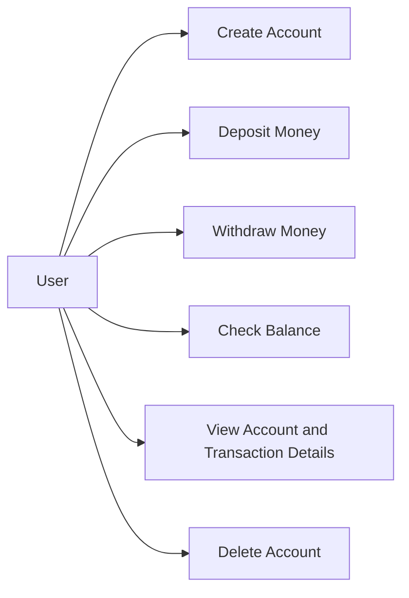
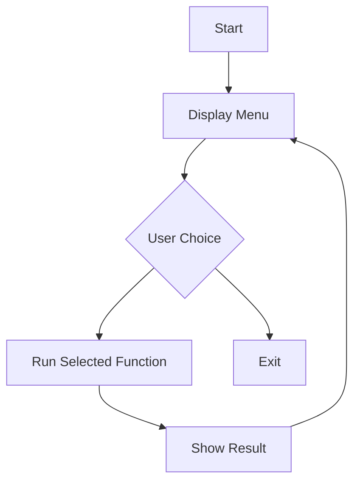
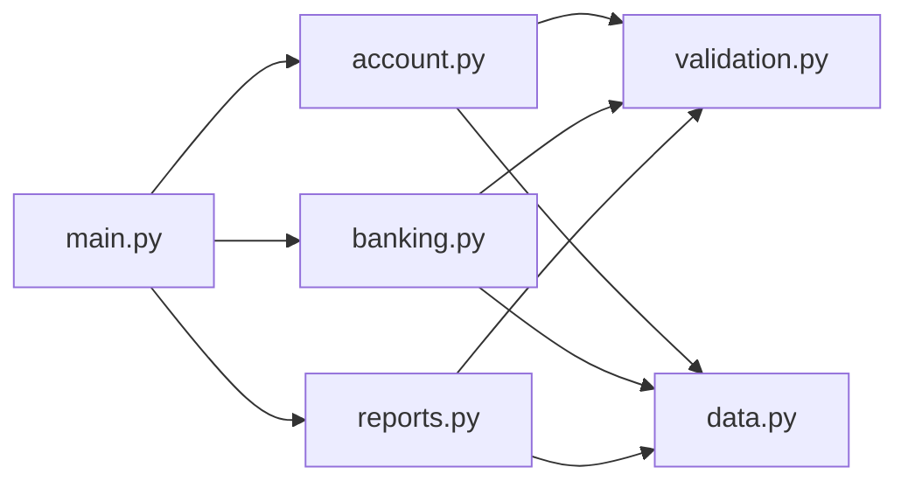

# Design Diagrams

## Use Case Diagram

```mermaid
flowchart LR
    U[User] --> A[Create Account]
    U --> B[Deposit Money]
    U --> C[Withdraw Money]
    U --> D[Check Balance]
    U --> E[View Account and Transaction Details]
    U --> F[Delete Account]
```

## Workflow Diagram

```mermaid
flowchart TD
    A[Start] --> B[Display Menu]
    B --> C{User Choice}
    C --> D[Run Selected Function]
    D --> E[Show Result]
    E --> B
    C --> F[Exit]
```

## Component Diagram

```mermaid
flowchart LR
    M[main.py] --> A[account.py]
    M --> B[banking.py]
    M --> R[reports.py]
    A --> V[validation.py]
    B --> V
    R --> V
    A --> D[data.py]
    B --> D
    R --> D
```
